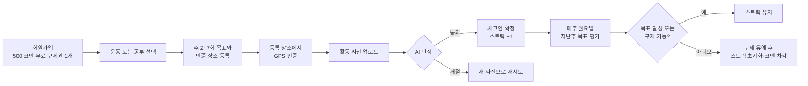
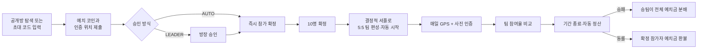
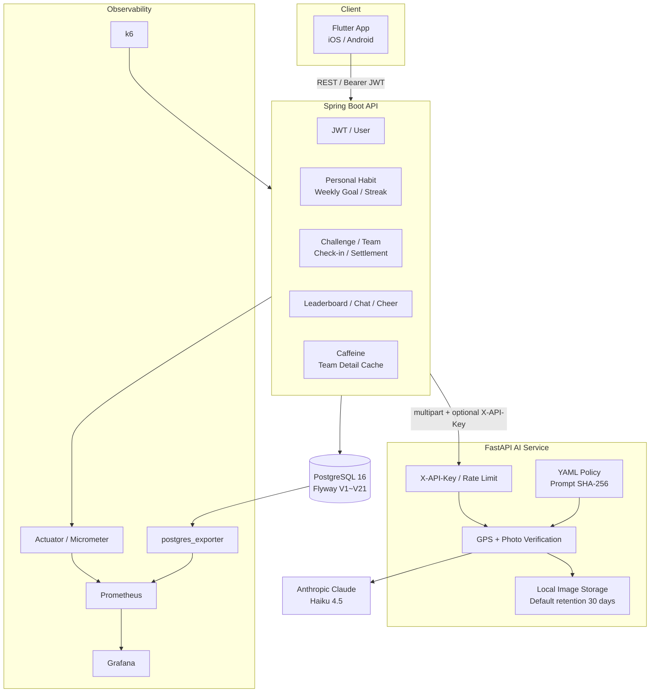

<p align="center">
  
</p>

# Booster

> 위치와 사진으로 습관 수행을 검증하고, 개인 목표와 5:5 팀 챌린지로 완주를 돕는 습관 서비스

Booster는 체크 버튼만 누르는 습관 기록기가 아닙니다. 사용자가 미리 정한 장소에 도착했는지 GPS로 확인하고, 실제 활동 장면을 AI가 판정한 뒤 인증을 확정합니다.

혼자서는 주간 목표와 스트릭, 구제권으로 꾸준함을 관리하고, 팀 챌린지에서는 10명이 5:5로 나뉘어 참여율을 겨룹니다. 개인 습관과 팀 챌린지는 인증·집계를 분리하되 하나의 계정과 코인 지갑을 공유합니다.

> 구현 기준: `main` 브랜치, [`b63e6c8`](https://github.com/HanSangJun01/Booster-AI-habit-service/commit/b63e6c828b2d47178ed855afa1010ff2546b6e19) (2026-09-09)

## 목차

- [프로젝트가 해결하려는 문제](#프로젝트가-해결하려는-문제)
- [현재 구현 상태](#현재-구현-상태)
- [사용자 흐름](#사용자-흐름)
- [핵심 기능](#핵심-기능)
- [시스템 아키텍처](#시스템-아키텍처)
- [서비스별 책임](#서비스별-책임)
- [기술 스택](#기술-스택)
- [핵심 기술적 결정](#핵심-기술적-결정)
- [프로젝트 구조](#프로젝트-구조)
- [실행 방법](#실행-방법)
- [API 개요](#api-개요)
- [테스트와 모니터링](#테스트와-모니터링)

## 프로젝트가 해결하려는 문제

일반적인 습관 앱은 사용자가 버튼만 눌러도 수행으로 기록합니다. 기록은 쉽지만 실제 행동과 분리되기 쉽고, 하루를 놓쳤을 때 긴 스트릭이 한 번에 사라지면 사용을 포기하기도 쉽습니다.

Booster는 다음 구조로 이 문제를 다룹니다.

- **검증 가능한 인증**: 등록 장소의 GPS 반경과 활동 사진을 함께 확인합니다.
- **현실적인 주간 목표**: 매일 강제하지 않고 주 2~7회 목표를 설정합니다.
- **회복 가능한 실패**: 목표 미달 시 구제권 또는 사후 구제로 스트릭을 지킬 기회를 제공합니다.
- **손실과 보상**: 스트릭 보상, 팀 예치 코인, 승리 정산으로 수행 동기를 만듭니다.
- **사회적 책임감**: 10명이 5:5로 나뉘어 팀 참여율을 비교합니다.

## 현재 구현 상태

| 영역 | 상태 | 실제 구현 |
|---|---|---|
| Flutter 앱 | 구현 | 가입·로그인, 홈, 개인 습관 설정, GPS/사진 인증, 팀 챌린지, 구제권 상점, 마이페이지 |
| Spring Boot API | 구현 | 사용자, 코인, 스트릭, 개인 체크인, 주간 평가, 챌린지, 참가, 팀, 정산, 소셜 API |
| AI 인증 서비스 | 구현 | GPS 계산, Claude Vision 사진 판정, 정책 파일, 이미지 검증·보관·정리 |
| PostgreSQL | 구현 | Flyway V1~V21, 인증/코인/정산/AI 판정 이력과 동시성 제약 |
| 모니터링 | 구현 | Actuator, Prometheus, Grafana, postgres_exporter, k6 |
| 멀티 인스턴스 실험 | 구현 | Nginx + 백엔드 3개 + DB + 모니터링 Compose |
| 팀 채팅·응원·리더보드 | API만 구현 | Spring API는 있으나 현재 Flutter 화면과 연결되지 않음 |
| 기프티콘 | 미구현 | 앱에 “준비 중” 카드만 존재 |
| 푸시·소셜 로그인·비밀번호 재설정 | 미구현 | 관련 인프라와 API 없음 |

현재 새로 만드는 개인 습관과 팀 챌린지의 인증 방식은 **`GPS_PHOTO_AI`(위치+사진)** 하나로 고정되어 있습니다. AI 판정 카테고리는 **운동(`EXERCISE`)**과 **공부·독서(`STUDY`)**를 지원합니다.

## 사용자 흐름

### 개인 습관



1. 회원가입하면 500코인과 무료 구제권 1개를 받습니다.
2. 운동 또는 공부·독서를 고르고 주 2~7회 목표와 인증 장소를 등록합니다.
3. 현재 위치가 등록 반경 안이면 체크인이 `PENDING`으로 생성됩니다.
4. JPEG/PNG/WebP 사진을 올리면 Claude Vision이 활동 수행 여부를 판정합니다.
5. 통과 시 체크인이 확정되고 누적 스트릭이 1 증가합니다. 7회 단위로 100코인을 받습니다.
6. 매주 월요일 00:01 KST에 지난주 목표를 평가합니다.
7. 미달이면 무료 구제권을 먼저, 구매 구제권을 나중에 자동 사용합니다.
8. 구제권이 없으면 2일의 유예 동안 1,200코인으로 사후 구제할 수 있습니다. 그대로 만료되면 스트릭이 0이 되고 최대 500코인이 차감됩니다.

### 팀 챌린지



1. 공개 챌린지를 검색하거나 비공개 초대 코드로 방을 찾습니다.
2. 챌린지를 만든 사람도 첫 번째 확정 참가자가 되며 같은 예치금을 냅니다.
3. 참가 승인은 자동 또는 방장 승인 방식입니다.
4. 확정 참가자가 10명이 되면 서버가 A팀/B팀 5명씩 편성하고 챌린지를 시작합니다.
5. 참여자는 자기 기준 위치에서 GPS 확인 후 활동 사진을 제출합니다.
6. 성공 체크인을 바탕으로 팀 참여율을 계산합니다.
7. 기간 종료 후 참여율이 높은 팀이 전체 예치 코인을 나눠 받고, 동률이면 확정 참가자에게 예치금을 돌려줍니다.

## 핵심 기능

### 인증과 사용자

- 이메일/비밀번호 회원가입과 로그인
- BCrypt 비밀번호 해시와 JWT Bearer 인증
- 가입 응답에서 Access Token 즉시 발급
- 마이페이지, 코인 거래 내역, soft delete 회원 탈퇴
- 비활성 계정의 인증·코인 조회 차단

### 개인 습관

- 운동 또는 공부·독서 카테고리
- 주 2~7회 목표와 이번 주 진행률
- GPS 기준 위치와 10~1,000m 반경
- 위치와 목표 변경 예약: 다음 달 1일 반영
- 일 1회 성공 체크인과 월별 달력
- 누적 인증 스트릭, 최고 스트릭, 7회 단위 100코인 보상
- 주간 목표 자동 채점과 구제 유예

### AI 사진 인증

- 위치 판정 후 사진을 받는 2단계 체크인
- JPEG/PNG/WebP, 최대 10MB
- 파일 확장자가 아닌 실제 이미지 바이트 검사
- EXIF 촬영 시각 기반 오래된 사진 사전 반려(기본 48시간)
- LangChain structured output으로 판정 응답 강제
- AI 응답 실패와 실제 인증 거절을 구분
- 개인: 일 3회 시도, 60초 쿨다운, 사용자 단위 동일 사진 재사용 차단
- 팀: 같은 챌린지 안에서 동일 사진 재사용 차단

### 팀 챌린지

- 공개 검색과 비공개 초대 코드
- 자동 승인과 방장 승인
- 10명 정원, 5:5 자동 편성
- 모집 중 참가 취소·예치금 환불
- 모집 중 방장 취소·전원 환불
- 일일 체크인과 팀별 참여율 비교
- 종료 감지, 정산, 실패 정산 재시도
- 개인/팀 리더보드, 팀 채팅, 응원 REST API

### 코인과 구제권

| 이벤트 | 코인/아이템 변화 |
|---|---:|
| 회원가입 | +500코인, 무료 구제권 1개 |
| 누적 인증 7·14·21…회 | +100코인 |
| 구제권 사전 구매 | -800코인, 구매 구제권 +1 |
| 미달 후 사후 구제 | -1,200코인 |
| 미달 최종 확정 | 최대 -500코인, 스트릭 0 |
| 챌린지 참가 | 설정한 예치 코인 차감 |
| 챌린지 승리 | 전체 예치금 풀을 승팀 확정 참가자가 분배 |
| 챌린지 동률 | 확정 참가자에게 예치금 환불 |

무료 구제권은 매월 1일 1개로 재설정되어 이월되지 않습니다. 구매 구제권은 소멸하지 않으며, 미달 시 무료분부터 자동 사용됩니다.

## 시스템 아키텍처



사진 원본은 AI 서비스의 로컬 스토리지에 저장되고, Spring 백엔드는 모델명·통과 여부·확신도·사유·라벨·`storage_key`·이미지 SHA-256 같은 판정 메타데이터를 PostgreSQL에 저장합니다.

## 서비스별 책임

| 서비스 | 책임 | 하지 않는 일 |
|---|---|---|
| Flutter | 화면, 기기 위치/카메라 접근, 세션 메모리, API 호출과 오류 안내 | 코인·승패·인증 결과를 자체 확정하지 않음 |
| Spring Boot | 인증·소유권, 도메인 규칙, 체크인 상태, 코인/스트릭, 팀 편성·정산, 영속화 | 사진 내용 자체를 판정하지 않음 |
| FastAPI AI | GPS 거리 계산, 이미지 검증·보관, Claude 사진 판정, 정책 추적 | JWT 사용자 인증, 소유권, 코인, 스트릭, 체크인 원장을 관리하지 않음 |
| PostgreSQL | 사용자·코인 원장·체크인·주간 평가·챌린지·정산·판정 이력 | 이미지 원본을 저장하지 않음 |
| Prometheus/Grafana | HTTP/JVM/DB 풀/정합성 지표 수집과 시각화 | 애플리케이션 상태를 수정하지 않음 |

## 기술 스택

| 영역 | 기술 |
|---|---|
| Client | Flutter, Dart, `http`, `geolocator`, `image_picker`, `flutter_map` |
| Backend | Java 23, Spring Boot 3.5.0, Spring Web/Security/Validation/Data JPA |
| Database | PostgreSQL 16, Flyway |
| Auth | JWT(JJWT), BCrypt |
| Cache/Lock | Caffeine, JPA optimistic/pessimistic lock, ShedLock JDBC |
| AI | Python 3.13, FastAPI, Pydantic v2, LangChain, Claude Haiku 4.5, Pillow |
| Test | JUnit 5, Spring Test, H2, Testcontainers, pytest, Flutter Test, k6 |
| Infra | Docker, Docker Compose, Nginx |
| Observability | Actuator, Micrometer, Prometheus, Grafana, postgres_exporter |

## 핵심 기술적 결정

### 1. 주간 목표와 누적 스트릭

주 3회 목표에서 월·수·금 사이의 휴식일은 실패가 아닙니다. 그래서 스트릭을 연속 날짜가 아니라 **성공 인증의 누적 횟수**로 정의하고, 초기화 책임을 주간 평가 한 곳에 모았습니다.

### 2. 목표와 위치는 예약 변경

주중에 목표를 낮추거나 인증 직전 현재 위치로 장소를 옮기는 회피를 막기 위해 목표와 위치 변경은 예약 값으로 저장하고 **다음 달 1일**에 반영합니다. 카테고리는 채점 횟수에 영향을 주지 않으므로 즉시 바뀝니다.

### 3. 신규 인증은 위치+사진으로 고정

위치만 확인하면 다른 사람이 현장에서 대신 체크인할 수 있고, 사진만 확인하면 예전 사진을 재사용하기 쉽습니다. 신규 개인 설정과 챌린지는 두 조건을 함께 쓰는 `GPS_PHOTO_AI`만 허용합니다.

### 4. 팀 편성은 결정적 셔플

참가자 ID를 정렬한 뒤 `challengeId`를 시드로 섞습니다. 여러 백엔드 인스턴스 중 어느 노드가 실행하더라도 같은 5:5 결과를 만들기 위한 선택입니다.

### 5. 코인이 걸린 정산은 원장을 재계산

팀 상세 화면은 빠른 응답을 위해 Caffeine과 저장된 참여율을 사용하지만, 최종 정산은 성공 체크인 원장을 다시 집계합니다. 화면 캐시의 지연이 보상 오류로 이어지지 않습니다.

### 6. AI 판정 정책을 코드 밖에서 관리

판정 기준과 출력 설명은 [`ai-service/policies/verification.yaml`](ai-service/policies/verification.yaml)에 모았습니다. 코드 카테고리와 정책 파일이 어긋나면 서비스를 기동하지 않고, 판정 결과에 정책 SHA-256을 남깁니다.

### 7. 판정 불가와 인증 거절을 구분

모델 호출 실패나 structured output 파싱 실패는 `passed=false`가 아니라 502입니다. “사진이 기준 미달”인 경우와 “서비스가 판정하지 못함”을 구분해 정상 사용자가 잘못 반려되지 않게 합니다.

## 프로젝트 구조

```text
Booster-AI-habit-service/
├── frontend/booster_app/       # Flutter 앱
│   ├── lib/
│   │   ├── core/               # API 클라이언트, 세션, 위치
│   │   ├── models/             # API 모델
│   │   ├── screens/            # 인증·홈·팀·상점·마이페이지
│   │   ├── services/           # 백엔드 API 호출
│   │   └── widgets/            # 공통 UI
│   └── test/                   # 위젯·사용자 흐름 테스트
├── backend/                    # Spring Boot REST API
│   ├── src/main/java/com/booster/
│   │   ├── auth/ user/ coin/
│   │   ├── personalcheckin/ personallocation/ weeklygoal/
│   │   ├── challenge/ participant/ team/ challengecheckin/
│   │   ├── settlement/ social/
│   │   └── shared/ config/
│   ├── src/main/resources/db/migration/  # Flyway V1~V21
│   └── src/test/                         # 단위·통합·동시성 테스트
├── ai-service/                  # FastAPI + Claude Vision
│   ├── main.py                  # API와 인증 방식 조합
│   ├── verifier.py              # LangChain structured output
│   ├── policies/                # 판정 정책 YAML
│   ├── storage.py               # 로컬 스토리지와 보존 기간 정리
│   └── tests/                   # API·GPS·하드닝·프롬프트 테스트
├── monitoring/                  # Grafana, k6, SQL 시드, 검증 프로브
├── docs/                        # API·ERD·성능·설계 기록
├── docker-compose.yml           # DB + Backend + 선택적 AI
├── docker-compose.monitoring.yml
└── docker-compose.multi.yml     # Nginx + Backend 3대 실험 구성
```

## 실행 방법

### 사전 준비

- Docker Desktop 또는 Docker Engine + Compose
- Flutter SDK 3.x
- AI 사진 판정을 사용할 경우 Anthropic API 키
- 개별 백엔드 실행 시 JDK 23
- 개별 AI 서비스 실행 시 Python 3.13 권장

### 1. 저장소 받기

```bash
git clone https://github.com/HanSangJun01/Booster-AI-habit-service.git
cd Booster-AI-habit-service
```

### 2. AI 환경변수 설정

```bash
cp ai-service/.env.example ai-service/.env
```

`ai-service/.env`에서 최소 다음 값을 설정합니다.

```dotenv
ANTHROPIC_API_KEY=your-anthropic-api-key
AI_SERVICE_API_KEY=local-shared-secret
```

Spring 백엔드도 같은 공유 키를 보내야 합니다. Compose 실행 셸에 동일한 값을 전달합니다.

### 3. DB + 백엔드 + AI 서비스 실행

```bash
AI_SERVICE_API_KEY=local-shared-secret \
docker compose --profile ai up -d --build
```

상태를 확인합니다.

```bash
curl http://localhost:8080/actuator/health
curl http://localhost:8000/health
```

AI 서비스는 선택 프로필입니다. `docker compose up`만 실행하면 DB와 백엔드만 뜨며, 현재 제품의 위치+사진 인증을 끝내려면 `--profile ai`가 필요합니다.

### 4. Flutter 앱 실행

```bash
cd frontend/booster_app
flutter pub get
flutter run
```

기본 API 주소:

| 환경 | 기본 주소 |
|---|---|
| Android 에뮬레이터 | `http://10.0.2.2:8080/api` |
| iOS 시뮬레이터·Web·Desktop | `http://localhost:8080/api` |

실기기는 개발 PC의 LAN IP를 지정합니다.

```bash
flutter run \
  --dart-define=API_BASE_URL=http://192.168.0.10:8080/api
```

운영 환경에서는 HTTPS API 주소를 사용해야 합니다.

### 서비스별 개별 실행

백엔드:

```bash
docker compose up -d db

cd backend
JWT_SECRET=replace-with-a-long-random-secret \
AI_SERVICE_URL=http://localhost:8000 \
AI_SERVICE_API_KEY=local-shared-secret \
./gradlew bootRun
```

AI 서비스:

```bash
cd ai-service
python3 -m venv .venv
source .venv/bin/activate
pip install -r requirements.txt
cp .env.example .env
uvicorn main:app --reload --port 8000
```

## 주요 환경변수

### Spring Boot

| 변수 | 기본값 | 설명 |
|---|---|---|
| `DB_URL` | `jdbc:postgresql://localhost:5432/booster...` | PostgreSQL 연결 |
| `DB_USERNAME` / `DB_PASSWORD` | `booster` | DB 계정 |
| `JWT_SECRET` | 로컬 개발 키 | 운영에서 반드시 교체 |
| `JWT_ACCESS_EXPIRATION_MS` | `86400000` | Access Token 만료, 기본 24시간 |
| `AI_SERVICE_URL` | `http://localhost:8000` | FastAPI 주소 |
| `AI_SERVICE_API_KEY` | 빈 값 | FastAPI와 공유하는 키 |
| `DB_POOL_MAX` | `30` | 인스턴스당 Hikari 최대 풀 |
| `VERIFICATION_MAX_ATTEMPTS_PER_DAY` | `3` | AI 인증 일일 시도 상한 |
| `VERIFICATION_ATTEMPT_COOLDOWN_SECONDS` | `60` | AI 재시도 간격 |

### AI 서비스

| 변수 | 기본값 | 설명 |
|---|---|---|
| `ANTHROPIC_API_KEY` | 빈 값 | Claude API 키 |
| `ANTHROPIC_MODEL` | `claude-haiku-4-5-20251001` | Vision 모델 |
| `AI_SERVICE_API_KEY` | 빈 값 | `/verify*` 공유 키 |
| `RATE_LIMIT_PER_MINUTE` | `30` | 키가 없을 때 IP당 분당 제한 |
| `ANTHROPIC_TIMEOUT_SECONDS` | `25` | 모델 호출 타임아웃 |
| `MAX_IMAGE_MB` | `10` | 이미지 크기 상한 |
| `MAX_PHOTO_AGE_HOURS` | `48` | EXIF 최근성 기준, 0이면 비활성 |
| `STORAGE_RETENTION_DAYS` | `30` | 로컬 이미지 보존 기간, 0이면 비활성 |
| `POLICY_DIR` | `ai-service/policies` | 판정 정책 디렉터리 |

## API 개요

Spring Base URL: `http://localhost:8080/api`  
AI Base URL: `http://localhost:8000`

`/api/auth/**`를 제외한 Spring API는 `Authorization: Bearer <accessToken>`이 필요합니다. 현재 성공 응답은 두 형태가 공존합니다.

- 개인/사용자 API: DTO를 바로 반환
- 챌린지/팀 API: `{"success": true, "message": ..., "data": ...}`
- 에러: `{"success": false, "message": ..., "errorCode": ...}`

### Spring Boot API

| 영역 | Method | Path | 설명 |
|---|---|---|---|
| Auth | `POST` | `/api/auth/signup` | 회원가입, 토큰 발급 |
| Auth | `POST` | `/api/auth/login` | 로그인 |
| Auth | `POST` | `/api/auth/logout` | 클라이언트 토큰 폐기 안내 |
| User | `GET`, `DELETE` | `/api/users/me` | 내 정보, 회원 탈퇴 |
| User | `GET` | `/api/users/me/coins` | 코인 내역 |
| Dashboard | `GET` | `/api/dashboard/home?month=yyyyMM` | 홈 집계와 달력 |
| Personal Location | `POST`, `PUT`, `GET` | `/api/users/me/location` | 위치 등록, 변경 예약, 조회 |
| Personal Check-in | `POST` | `/api/personal/check-in` | GPS 확인과 체크인 생성 |
| Personal Check-in | `GET` | `/api/personal/check-in/today` | 오늘 상태와 `checkInId` |
| Personal AI | `POST` | `/api/personal/check-in/{checkInId}/ai-verification` | 개인 사진 판정·확정 |
| Weekly Goal | `GET`, `PUT` | `/api/personal/weekly-goal` | 목표/구제권 현황, 변경 예약 |
| Recovery | `POST` | `/api/personal/recovery-tickets` | 구제권 사전 구매 |
| Recovery | `POST` | `/api/personal/rescue` | 미달 주 사후 구제 |
| Challenge | `POST`, `GET` | `/api/challenges` | 생성, 공개 검색 |
| Challenge | `GET`, `DELETE` | `/api/challenges/{challengeId}` | 상세, 모집 중 방 취소 |
| Challenge | `GET` | `/api/challenges/invite/{code}` | 초대 코드 조회 |
| Challenge | `GET` | `/api/users/me/challenges` | 내 활성 챌린지 |
| Participant | `POST`, `GET` | `/api/challenges/{id}/participants` | 참가 신청, 참가자 목록 |
| Participant | `DELETE` | `/api/challenges/{id}/participants/{userId}` | 모집 중 내 참가 취소 |
| Participant | `POST` | `/api/challenges/{id}/participants/{participantId}/approve` | 방장 승인 |
| Team | `GET` | `/api/challenges/{id}/teams` | 편성된 팀 목록 |
| Team Check-in | `POST`, `GET` | `/api/challenges/{id}/check-ins` | 체크인 생성, 일자별 현황 |
| Team Detail | `GET` | `/api/challenges/{id}/team-detail` | 내 팀/상대 팀 참여율 |
| Team AI | `POST` | `/api/verification-submissions/{submissionId}/ai-verification` | 팀 사진 판정·확정 |
| Settlement | `GET` | `/api/challenges/{id}/result` | 정산 결과 |
| Leaderboard | `GET` | `/api/challenges/{id}/leaderboards?type=TEAM|PERSONAL` | 리더보드 |
| Chat | `GET`, `POST` | `/api/teams/{teamId}/chat` | 팀 메시지 조회·작성 |
| Chat | `DELETE` | `/api/teams/{teamId}/chat/{messageId}` | 내 메시지 삭제 |
| Cheer | `POST` | `/api/challenges/{id}/cheers` | 참가자에게 응원 보내기 |

### AI 서비스 API

| Method | Path | 설명 |
|---|---|---|
| `GET` | `/health` | 모델, 정책 해시, 설정 상태 |
| `POST` | `/verify`, `/verify/photo` | 사진 AI 판정 |
| `POST` | `/verify/gps` | Haversine GPS 반경 판정 |
| `POST` | `/verify/check-in` | GPS와 사진을 한 요청에서 종합 판정 |

Spring 백엔드는 `/verify`를 사용합니다. 나머지 AI 엔드포인트는 사용자·체크인·코인 상태를 저장하지 않는 독립 판정 API입니다.

상세 계약은 [`docs/api/AI_SERVICE_SPEC.md`](docs/api/AI_SERVICE_SPEC.md)와 [`docs/project-plan.md`](docs/project-plan.md)를 참고하되, 일부 설명은 현재 `main`보다 오래됐으므로 컨트롤러와 DTO를 최종 기준으로 확인해 주세요.

## 테스트와 모니터링

### 테스트 실행

백엔드:

```bash
cd backend
./gradlew test
```

일부 동시성 테스트는 Docker에서 실제 PostgreSQL을 띄우는 Testcontainers를 사용합니다.

AI 서비스:

```bash
cd ai-service
python3 -m venv .venv
source .venv/bin/activate
pip install -r requirements.txt -r requirements-dev.txt
python -m pytest tests -q
```

AI 단위 테스트는 실제 Anthropic 호출 없이 동작합니다. GPS 경계값, 이미지 하드닝, API 계약, LangChain structured output, 정책-카테고리 정합성, 프롬프트 골든을 검증합니다.

Flutter:

```bash
cd frontend/booster_app
flutter pub get
flutter test
```

### 모니터링 스택

백엔드를 8080에서 실행한 뒤:

```bash
docker compose -f docker-compose.monitoring.yml up -d
```

| 도구 | 주소 | 용도 |
|---|---|---|
| Spring Actuator | `http://localhost:8080/actuator/health` | 상태 확인 |
| Prometheus | `http://localhost:9090` | 지표 조회 |
| Grafana | `http://localhost:3000` | 대시보드, 기본 `admin/admin` |

저장소에는 다음 검증 자산이 포함되어 있습니다.

- 개인 축: load, stress, soak, write k6 시나리오
- 팀 축: 일반 부하, 포화, 핫키, team-detail 캐시 시나리오
- 통합 축: 가입부터 개인/팀 인증·코인·탈퇴까지 사용자 여정
- PostgreSQL 정합성 지표: 코인 원장 불일치, 음수 잔액, 중복 채점/체크인, 오래된 PENDING
- Nginx + 백엔드 3개 인스턴스에서 정산 failover/중복 지급 검증

과거 측정 결과와 조건은 [`docs/monitoring/`](docs/monitoring/)에 기록되어 있습니다. 이 수치는 실행 환경과 당시 브랜치에 종속된 벤치마크이며 운영 SLA는 아닙니다.


## 관련 문서

- [프로젝트 계획과 API 계약](docs/project-plan.md)
- [MVP ERD](docs/erd/MVP_ERD.md)
- [AI 서비스 API](docs/api/AI_SERVICE_SPEC.md)
- [AI 서비스 실행·튜닝](ai-service/README.md)
- [모니터링 도구](monitoring/README.md)
- [모니터링 결과와 회고](docs/monitoring/README.md)

